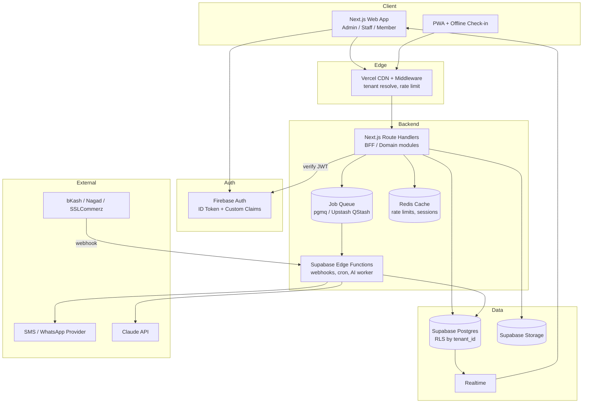
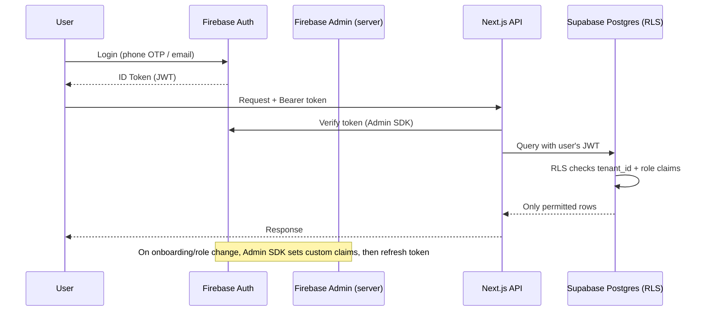
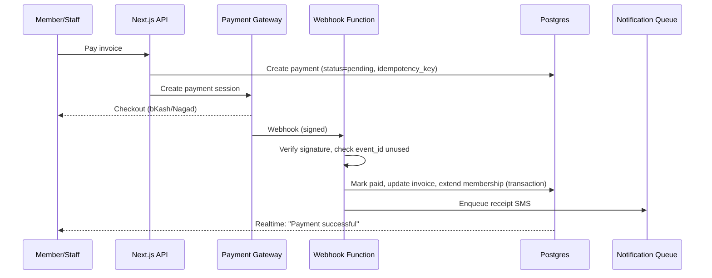
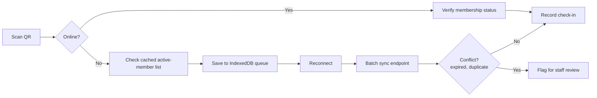
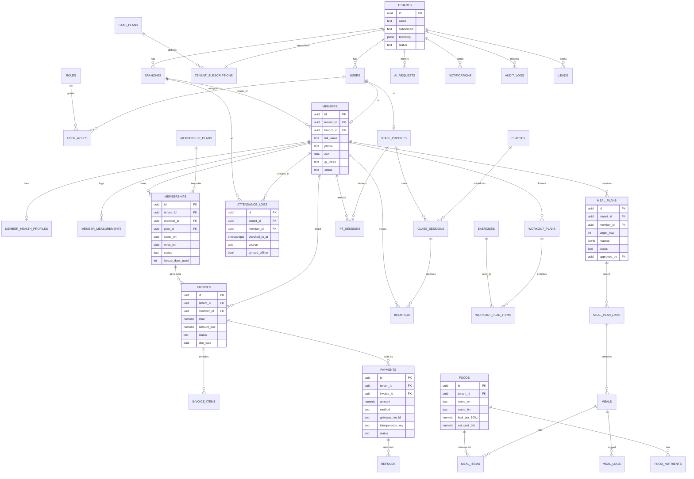
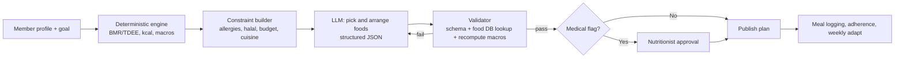
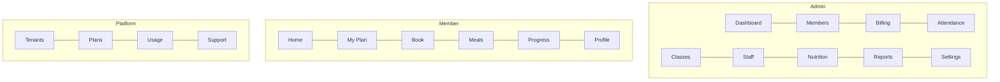

# GymOS: Gym SaaS Platform Blueprint

**Stack:** Next.js (App Router) · Tailwind CSS + shadcn/ui · Supabase (Postgres, Storage, Realtime, Edge Functions) · Firebase Auth · JWT · Redis (Upstash) · Vercel

---

## 1. Product vision

A multi-tenant platform where each gym (tenant) gets an admin dashboard, staff tools, and a member portal, with local payments (bKash/Nagad), automated reminders, offline check-in, and an AI meal planner using Bangladeshi food data.

**Positioning:** "Recover dues, reduce churn, earn more per member."

---

## 2. Feature map

### Core (MVP)

| Module                | Features                                                                         |
|-----------------------|----------------------------------------------------------------------------------|
| Tenant and branding   | Gym onboarding, logo/colors, subdomain, branches, feature flags per plan         |
| Auth and RBAC         | Phone/email login, 2FA for owners, roles, permission matrix                      |
| Members               | Profiles, health info, documents, import from Excel/CSV, tags                    |
| Plans and memberships | Packages, PT bundles, freeze/pause, discounts, auto-expiry                       |
| Billing               | Invoices, dues, receipts, refunds, bKash/Nagad/SSLCommerz, cash entry with audit |
| Attendance            | QR check-in, staff scan, offline queue, payment-status gate                      |
| Notifications         | SMS/WhatsApp/push/email templates, renewal and due reminders (Bangla)            |
| Owner dashboard       | Live revenue, dues, expiring members, attendance, new joins                      |

### Growth (Phase 2)

Class scheduling and booking with waitlists, trainer commission and payroll, workout plans and progress tracking, lead CRM, churn-risk list, POS/inventory, multi-branch reports.

### Differentiators (Phase 3)

AI meal planner, wearables, challenges/leaderboards, upsell engine, white-label mobile app, public API and webhooks.

### Platform owner (you)

Tenant management, SaaS subscriptions, usage metering (SMS, AI), impersonation with audit, support tools, global analytics.

---

## 3. Architecture

Do not start with many separate services. Use a **modular monolith in Next.js** plus **Supabase Edge Functions** for isolated workloads. Split later only where load demands it.



### Logical services (modules now, separable later)

| Module                  | Runs as                            | Notes                                     |
|-------------------------|------------------------------------|-------------------------------------------|
| Identity and Tenant     | Next.js + Firebase                 | Claims: `tenant_id`, `role`, `branch_ids` |
| Members and Memberships | Next.js modules                    | Core CRUD via Supabase                    |
| Billing and Payments    | Next.js + Edge Function (webhooks) | Idempotent, signed webhooks               |
| Attendance              | Next.js + offline sync endpoint    | Batch sync, conflict rules                |
| Notifications           | Edge Function + queue              | Retry, delivery logs, cost metering       |
| AI Meal Planner         | Isolated Edge Function/worker      | Rate-limited, cost tracked per tenant     |
| Analytics               | Postgres views/materialized views  | Refreshed by cron                         |

---

## 4. Auth and security design

**Firebase Auth + Supabase:** Configure Supabase's third-party auth to accept Firebase ID tokens. RLS policies then read claims from the token.



### Security checklist

- **RLS on every tenant table:** `tenant_id = auth.jwt() ->> 'tenant_id'`. Write automated tests that prove tenant A cannot read tenant B.
- Never expose the Supabase **service role key** to the browser; use it only in server code and Edge Functions.
- Short-lived ID tokens (1h), refresh tokens revoked on role change or staff removal.
- Owner/finance actions need recent re-auth or 2FA.
- Validate all input with **Zod** on the server; parameterized queries only.
- Payment webhooks: verify signature, store `event_id` for **idempotency**, never trust client-reported payment status.
- Encrypt sensitive fields (national ID, medical notes); Supabase encrypts at rest, and TLS is in transit.
- **Audit log** (append-only) for money, role, and data-export actions.
- Rate limiting by IP + user + tenant (Redis); CAPTCHA on OTP endpoints; CSP and security headers.
- Daily backups + point-in-time recovery; quarterly restore drill.
- Consent capture for health data; data export/delete endpoints.

---

## 5. Performance and reliability

| Goal                        | Technique                                                                            |
|-----------------------------|--------------------------------------------------------------------------------------|
| Fast dashboards             | Materialized views, indexes on `(tenant_id, created_at)`, Redis cache with short TTL |
| Smooth UI                   | Server Components, streaming, optimistic updates, skeleton loaders, TanStack Query   |
| Live feel                   | Supabase Realtime for check-ins, payments, dashboard counters                        |
| Heavy work off request path | Queue: reports, bulk SMS, invoice generation, AI calls                               |
| Failures                    | Retries with exponential backoff, dead-letter queue, idempotency keys                |
| Power/internet cuts         | PWA service worker, IndexedDB queue for check-ins, sync on reconnect                 |
| Observability               | Sentry, structured logs with `tenant_id` and `request_id`, uptime checks, alerts     |
| Cost control                | Per-tenant metering for SMS and AI tokens tied to plan limits                        |

### Payment workflow



### Offline check-in workflow



---

## 6. Database design

### Conventions

- UUID primary keys, `tenant_id` on every tenant-owned table, `created_at`, `updated_at`, `deleted_at` (soft delete), money stored as integer **poisha** or `numeric(12,2)`.
- Enums for statuses; indexes on `(tenant_id, foreign_key)`.

### Table groups

| Group                  | Tables                                                                                                       |
|------------------------|--------------------------------------------------------------------------------------------------------------|
| Platform               | `tenants`, `saas_plans`, `tenant_subscriptions`, `feature_flags`, `usage_meters`                             |
| Identity               | `users`, `roles`, `user_roles`, `staff_profiles`, `branches`                                                 |
| Members                | `members`, `member_health_profiles`, `member_documents`, `member_measurements`                               |
| Membership and billing | `membership_plans`, `memberships`, `invoices`, `invoice_items`, `payments`, `refunds`, `discounts`           |
| Attendance             | `attendance_logs`, `access_devices`                                                                          |
| Scheduling             | `classes`, `class_sessions`, `bookings`, `pt_sessions`                                                       |
| Workouts               | `exercises`, `workout_plans`, `workout_plan_items`, `workout_logs`                                           |
| Nutrition/AI           | `foods`, `food_nutrients`, `meal_plans`, `meal_plan_days`, `meals`, `meal_items`, `meal_logs`, `ai_requests` |
| CRM                    | `leads`, `lead_activities`                                                                                   |
| Comms                  | `notification_templates`, `notifications`, `campaigns`                                                       |
| System                 | `audit_logs`, `webhook_events`, `jobs`                                                                       |

### ER diagram (core)



### RLS pattern (example)

```sql
alter table members enable row level security;

create policy tenant_isolation on members
  using (tenant_id = (auth.jwt() ->> 'tenant_id')::uuid);

create policy member_self_read on members for select
  using (user_id = (auth.jwt() ->> 'sub')::text
         or (auth.jwt() ->> 'role') in ('owner','manager','staff'));
```

### Indexing essentials

`members(tenant_id, phone)`, `memberships(tenant_id, ends_on, status)`, `invoices(tenant_id, status, due_date)`, `attendance_logs(tenant_id, checked_in_at desc)`, unique `payments(idempotency_key)`, unique `webhook_events(provider, event_id)`.

---

## 7. AI meal planner design



Rules: LLM never computes calories; all numbers come from your `foods` table. Enforce minimum calorie floors, block plans for flagged conditions (pregnancy, diabetes, eating disorders) without professional review, log every request in `ai_requests` for cost metering.

---

## 8. UI/UX and product design plan

*Working as designer and product lead together: the goal is calm, fast, and trustworthy, since owners check numbers and members check plans on their phones daily.*

### Users and top jobs

| User       | Top job                           | Success metric                        |
|------------|-----------------------------------|---------------------------------------|
| Owner      | "How is my business today?"       | Answered in under 5 seconds on mobile |
| Front desk | Check in and collect payment fast | Under 3 taps per member               |
| Trainer    | See assigned members and plans    | Zero searching                        |
| Member     | Check plan, pay, book, log meals  | One-thumb usable                      |

### Design principles

1.  **Numbers first:** the most important metric is the largest thing on screen.
2.  **One primary action per screen.**
3.  **Instant feedback:** optimistic updates, skeletons, toasts, no blank states.
4.  **Mobile-first, then desktop density.**
5.  **Bangla and English** everywhere; test long Bangla strings.
6.  **Tenant branding** applied via CSS variables.

### Design system

- **Type:** Inter (Latin) + Noto Sans Bengali; scale 12/14/16/20/24/32.
- **Color tokens:** `--brand` (tenant-set), neutral slate scale, semantic `success/warning/danger/info`. Default brand: deep indigo with an energetic accent. Dark mode from day one.
- **Spacing:** 4px grid; radius 12px cards, 8px inputs; soft shadows, 1px borders.
- **Components (shadcn/ui):** Button, Input, Select, DataTable (sortable, filter, bulk actions), Command palette (Ctrl+K), Sheet/Drawer, Dialog, Tabs, Badge, Stat card, Chart (Recharts), Calendar, Toast, Skeleton, Empty state.
- **Motion:** 150 to 200ms ease-out; no decorative animation.
- **Accessibility:** WCAG AA contrast, keyboard navigation, focus rings, 44px touch targets.

### Information architecture



### Key screens (design these first)

1.  **Owner dashboard:** revenue today/month, dues, expiring in 7 days, live check-ins, churn-risk list, quick actions.
2.  **Members list:** search, filters (status, branch, expiring), bulk SMS reminder, row status badges.
3.  **Member profile:** header (photo, status, QR), tabs: Overview, Payments, Attendance, Plans, Notes.
4.  **Front-desk check-in:** big scan area, instant green/red result with dues warning, "collect payment" button.
5.  **Invoice and payment:** amount due, method picker (bKash, Nagad, cash), receipt share.
6.  **Member mobile home:** membership status card, next class, today's meals, streak.
7.  **Meal planner:** goal summary, day tabs, meal cards with kcal/macros/cost, swap and log buttons.
8.  **Onboarding wizard:** gym details, branding, import CSV, invite staff.

### Frontend structure

    /app
      /(marketing)
      /(auth)/login
      /(admin)/[tenant]/dashboard|members|billing|...
      /(member)/home|plan|meals|...
      /(platform)/tenants|plans|usage
      /api/(payments|webhooks|checkin|ai)
    /modules   (members, billing, attendance, nutrition: each with schema, service, queries)
    /components/ui  (design system)
    /lib       (supabase, firebase, rbac, logger)
    /middleware.ts (tenant resolve, auth guard, rate limit)

---

## 9. Step-by-step delivery plan

**Phase 0: Discovery (Weeks 1-2)**

1.  Interview 10-15 gym owners; finalize pain-point list.
2.  Lock MVP scope, pricing hypotheses, SMS/payment provider choices.
3.  Start payment gateway and SMS sender registration (long lead time).

**Phase 1: Foundation (Weeks 3-5)** 4. Repo, CI/CD, environments (dev/staging/prod), lint, tests, Sentry. 5. Supabase schema migrations, RLS policies, seed data, tenant isolation tests. 6. Firebase Auth + custom claims + RBAC middleware. 7. Design system and tokens in Tailwind; build component library.

**Phase 2: Core MVP (Weeks 6-11)** 8. Tenant onboarding and branding. 9. Members CRUD + CSV import. 10. Plans, memberships, invoices, dues. 11. Payments (bKash/Nagad) with webhooks and idempotency. 12. QR check-in + offline PWA sync. 13. Notification queue: renewal and due reminders in Bangla. 14. Owner dashboard and member portal.

**Phase 3: Pilot (Weeks 12-16)** 15. Free pilot with 2-3 gyms; migrate their data; collect metrics. 16. Fix bugs, refine UX from observed usage, write case studies.

**Phase 4: Differentiators (Weeks 17-24)** 17. Bangladeshi food database + AI meal planner with approval flow. 18. Scheduling, trainer commissions, workout plans. 19. Churn-risk and upsell engine; SaaS billing and feature flags.

**Phase 5: Scale** 20. White-label app, public API, wearables, load testing, security audit, extract services that need independent scaling.

---

## 10. Definition of done for each feature

- RLS policy + isolation test
- Zod validation + error states
- Audit log for sensitive actions
- Loading, empty, and error UI
- Bangla and English strings
- Analytics event and Sentry coverage
- Documented API and migration

---

## 11. Key risks

| Risk                              | Mitigation                                                       |
|-----------------------------------|------------------------------------------------------------------|
| Tenant data leak                  | RLS + automated cross-tenant tests, security review              |
| Gateway onboarding delays         | Start in week 1; support manual entry meanwhile                  |
| SMS cost overruns                 | Metering, plan limits, credit packs                              |
| Firebase/Supabase claim sync bugs | Central claims service, token refresh on role change             |
| Scope creep                       | Ship Phase 2 only before pilot                                   |
| Health-data liability             | Consent, professional approval, disclaimers, conservative limits |
